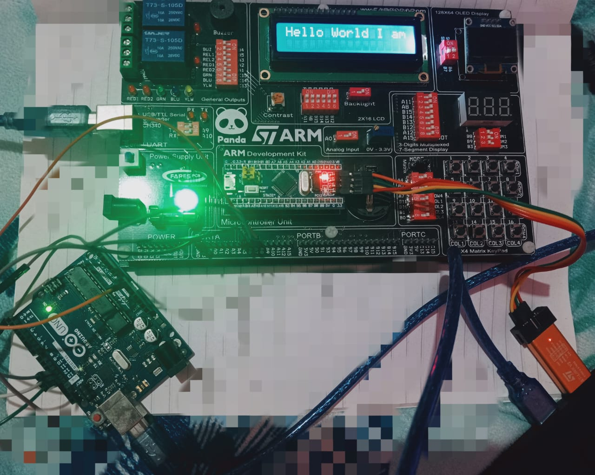
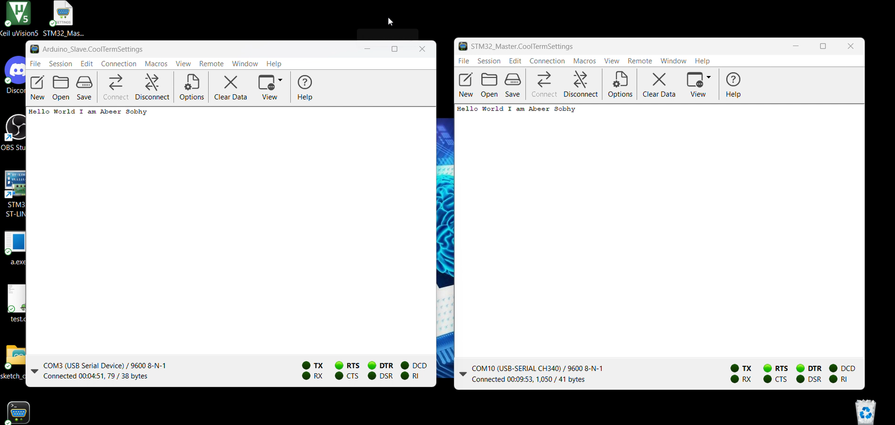

#  DualComm Bridge  
### A Bidirectional Communication Bridge between STM32 and Arduino using UART & SPI

## 📘 Overview

**DualComm Bridge** is a two-way communication system between an **STM32F103C8T6** (acting as the SPI Master & UART Host) and an **Arduino Uno** (acting as the SPI Slave).  

### Data starts from PC and ends with PC - It demonstrates synchronized data transfer in both directions :

### - PC <------UART-----> STM32 <----SPI----> Arduino <----UART----> PC

This setup effectively forms a *full-duplex communication bridge* between two microcontrollers and a PC.

## ⚙️ Hardware Setup

| Component | Role | Interface |
|------------|------|-----------|
| STM32F103C8T6 | SPI Master + UART Interface | UART ↔ PC, SPI ↔ Arduino |
| Arduino Uno / Nano | SPI Slave + UART Interface | SPI ↔ STM32, UART ↔ PC |
| PC / Serial Terminal | User Interface | UART ↔ STM32 & Arduino |

🧩 **Connections Summary**
| STM32 (SPI1) | Arduino (SPI) |
|---------------|----------------|
| PA5 (SCK)     | D13 (SCK)      |
| PA6 (MISO)    | D12 (MISO)     |
| PA7 (MOSI)    | D11 (MOSI)     |
| PA4 (NSS)     | D10 (SS)       |
| GND           | GND            |

## ⚡ Features

✅ Full-duplex two-way communication  
✅ UART (9600 baud, 8N1) and SPI (Mode 2, MSB first) synchronization  
✅ Bidirectional data forwarding between STM32 ↔ Arduino ↔ PC  
✅ Modular, testable codebase for both devices  

## 🖼️ Take a Look 

  

  

## 🎬 Demo Video
Here’s a short demo showing the system in action:  

🎥 [Watch the demo on YouTube](https://youtu.be/uubYdVKIsu8)

## 🚀 How to Use

1. **Flash the STM32** code using STM32CubeIDE or ST-Link Utility (where the .bin & .hex files are available on Debug file).  
2. **Upload the Arduino** `.ino` sketch using the Arduino IDE.  
3. **Open two Serial Monitors:** **CoolTerm Recommended**
   - STM32 COM port @ `9600 baud`
   - Arduino COM port @ `9600 baud`
4. Send data from either terminal — it will appear on the other side!

---

## 🧩 Development Notes

- SPI configured as **Mode0 (CPOL=0, CPHA=0)**  
- UART configured as **9600 baud, 8 data bits, 1 stop bit**  
- STM32 runs SPI master polling
- STM32 runs UART receive/read with interrupt mode & UART send/write with polling mode 
- Arduino runs SPI slave polling mode & UART read & write with polling   
---

## 🧪 Testing & CI (Future Plan)
- Unit Testing (gtest / CppUTest)
- Build Automation with CMake
- Continuous Integration (GitHub Actions)
---

## 👨‍💻 Authors

**Abeer Sobhy** — Embedded Systems Engineer  
📧 [abeer.sobhy.eg@gmail.com]  
---

⭐ *If you find this project helpful, don’t forget to star the repo!*  

